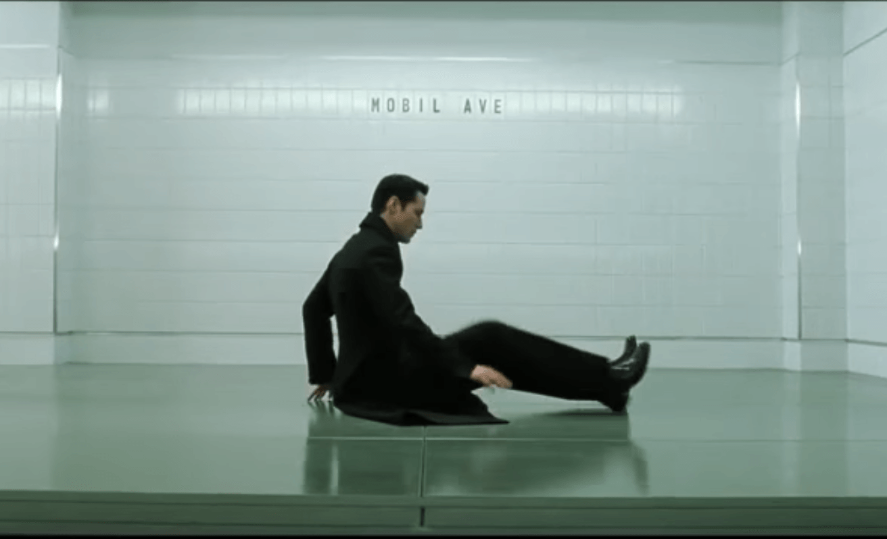
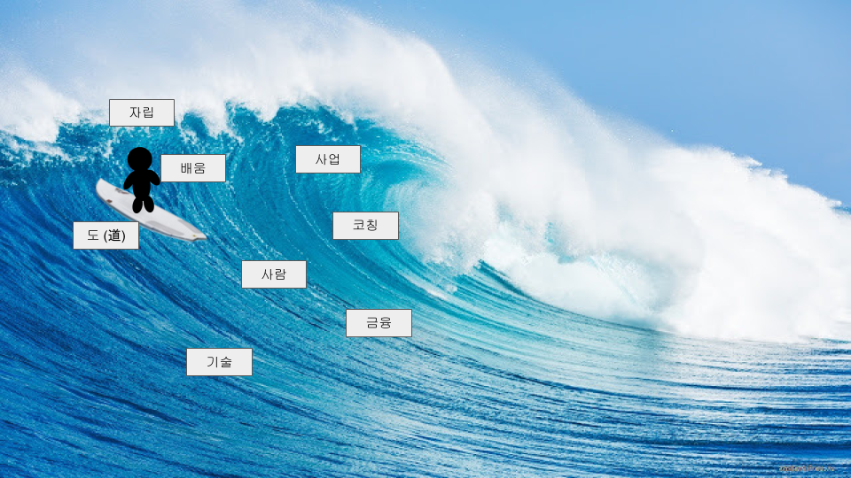

# 습관성 체크인 (한 일 & 느 낌)
- ORS (일어나서) + 한줄 소감 (느낌) [ORS 하기](https://forms.gle/aHyCqzpX2zdkST1v5)
- 팔굽혀펴기 + 철봉
- 오늘 한 일 / 내일 할 일 / 앞으로 할 일 [link](https://www.notion.so/notaai/00c556c2fba7465b976c103ce5be0f25)  - _Private_  ([Template](https://www.notion.so/notaai/20200-template-fb4d43856dfe44bab76393f06d1b65da))
- 팔굽혀펴기 + 철봉
- SRS (자기 전) + 한줄 소감 (느낌) [SRS 하기](https://forms.gle/d8KJ8nWFBKRPtqLJ7)

---

# 기록
- [일과 기록](https://www.notion.so/notaai/00c556c2fba7465b976c103ce5be0f25) - _Private_
- [생각 기록](https://workflowy.com/) - _Private_
- [그림 일기](https://docs.google.com/presentation/d/1CrJErrxvEqz25xQxUKQWNHiQMMvPzF6ToLjW3yOAmKs/edit?usp=sharing) - _Private_
- [코드 기록](http://143.248.251.111:8888/tree?) - _Private_

---

# 2020년의 목표
2020년의 목표는 내 삶을 안정화 시키는 것. 금전적인 걸로든 정신적인 걸로든

2019년에 너무 힘든 일이 많아서, 내 시계가 멈춰 버린 것 같았다.

잘 견디고 지나갔으니까 이제는 지나간 것에 매이지 않고, 내 시계를 앞으로 가도록 움직이는 것이 올해의 목표가 되겠다.

2020년에는 여러 이벤트가 있었는데,

- 홍콩과기대 자퇴
- 노타 입사
- AC2 39기 시작
- 이사 (아마도)
등등..

올 한해는 전반적으로 이런 느낌이었다. 이쪽 세상과 저쪽 세상의 중간에 끼어버려서, 나가고는 싶은데 밖에는 친구들이 기다리고 있는데 버둥버둥... 근데 자꾸만 제자리로 돌아오는 바람에, **답답하고**, **조급하고** 그랬다.

---

# 앞으로는 이랬으면 좋겠다
근데 앞으로는 이런 느낌이고 싶다. 무언가 나에게 닥쳐왔을 때 파도를 출렁출렁 잘 타면서 살아가고 싶다. 내 시계는 다시 움직일 수 있을까?

올 한해를 충실하게 보냈느냐 하는 질문에는, 내가 저 파도에 올라탄 기분이 1년중 몇 번이나 있었을지를 떠올려봐도 좋을 것 같다.
