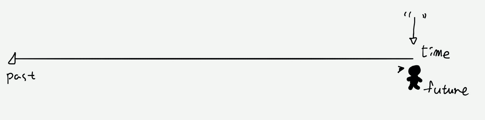

고대 희랍인들은 과거를 등지고 미래를 보는 우리와 달리, 미래를 등지고 과거를 본다고 했다.[^1]

- RPG게임에서 보스 잡기 전에 중간 세이브 하듯, 살면서 문득문득 발자국을 남겨 놓으려고 한다. 그러면 내가 어디에 있는지 볼 수 있겠지.

- 미래는 아무도 모른다. 미래를 아는 것처럼 계획하고 성취하거나 실망 하기 보다는 과거를 살펴보고 현재를 짚어보면서 내가 아는 것과 모르는 것을 구분하자.

- _ORS_ 와 _SRS_ 기록이 나의 현재를 짚고 tracking 하는데 도움이 된다.

- [ORS 하기](https://forms.gle/aHyCqzpX2zdkST1v5)

- [SRS 하기](https://forms.gle/d8KJ8nWFBKRPtqLJ7)

- [ORS / SRS 결과 보기](https://docs.google.com/spreadsheets/d/16K2k5BFjorkeQjp5iBtD5IOnC1HU21_odkgx4H6JIWI/edit?usp=sharing)
#### Footnote
[^1]: 선과 모터사이클 관리술 (p.)
