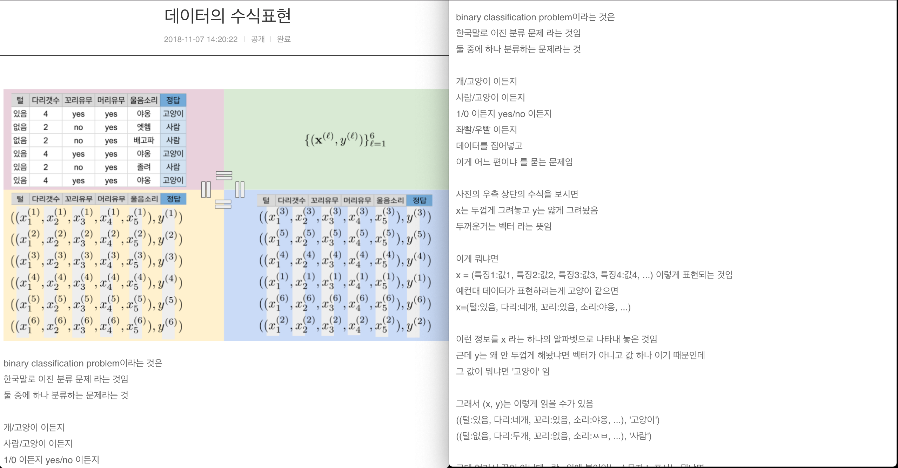

머신러닝을 시작하는 분들을 위한 수업입니다.

머신러닝의 주요 토픽들을 각각 이미지 한 장을 기반으로 설명합니다.

이렇게 하는 이유는, 한 장면을 여러 관점으로 곱씹는 것이 매우 효과적인 학습 방법이기 때문입니다.

장면이 시간을 따라 자주 넘어가면, 우리 뇌는 이전 것과 이번 것을 연관시키기 어려워합니다.

서로 무관할 것 같았던 다양한 개념들이 결국에 한 장면에서 통합되는 느낌을 받을 수 있도록 구성했습니다.

구글링으로 얼마든지 필요한 정보를 낱개로 꺼내 올 수 있는 세상에서

정보의 단편들을 통합하는 것은 여전히 사람의 몫이니까요.

구체적인 계산 방법에 초점을 맞추기보다는

이게 무슨 소리인가 했는데 보니까 이런 말이었구나 - 하는 느낌을 전달하는데 중점을 두고자 합니다.​
아하 모멘트 라고 하네요.

다음 그림처럼
모니터를 왼쪽 오른쪽으로 나눠서
한 쪽에는 그림을 고정해 둔 채로
한 쪽에는 설명을 내려가면서 읽으면 더 수월하게 읽으실 수 있습니다.

